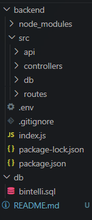

# Bintelli API

Este proyecto es una API construida para la empresa **BINTELLI**. Su objetivo es conectar viajes a través del mundo, permitiendo a los usuarios consultar rutas de vuelos a partir de un origen y un destino. Si la ruta existe, se devuelve la información correspondiente; si no, se notifica al usuario que no es posible calcular la ruta. Además, las rutas calculadas se almacenan en una base de datos para facilitar futuras consultas.

## Estructura de Carpetas


### Descripción de la Estructura

- **src/**: Contiene el código fuente de la aplicación.
  - **api/**: Aquí se encuentran los servicios de API utilizados para obtener información de vuelos.
  - **db/**: Contiene la configuración de la base de datos y el script SQL para crear las tablas.
  - **controllers/**: Aquí se encuentran las funciones que manejan la lógica de negocio de las rutas de vuelo.
  - **routes/**: Define las rutas de la API y sus controladores correspondientes.

- **.env**: Archivo de configuración que contiene las variables de entorno necesarias para la conexión a la base de datos y otras configuraciones.

- **.gitignore**: Especifica los archivos y carpetas que no deben ser seguidos por Git, como `node_modules` y el archivo `.env`.

- **index.js**: Archivo principal que inicializa el servidor y establece las rutas.

- **package.json** y **package-lock.json**: Archivos que gestionan las dependencias del proyecto.

- **binteli.sql**: Script SQL para crear la base de datos y las tablas necesarias.

## Instalación
### Asegurate de crear en archivo .env con las credenciales correspondientes, como por ejemplo: 


Para instalar y ejecutar este proyecto, sigue estos pasos:

1. Clona el repositorio:
```bash
git clone https://github.com/BonIcy/bintelliSol
```
2. Navega a la carpeta del proyecto:
```bash
cd backend
```
3. Instala las dependecias
```bash
npm i
```
4. Inicia el servidor en modo desarrollador
```bash
npm run dev
```

## Base de datos

La base de datos utilizada en este proyecto es **bintelli**, la cual almacena información relacionada con vuelos y rutas de viaje.

### Tablas

#### 1. **Transport**

Esta tabla almacena información sobre las aerolíneas y sus respectivos números de vuelo.

- **id**: INT, clave primaria, auto-incremental.
- **FlightCarrier**: VARCHAR(255), nombre de la aerolínea, no puede ser nulo.
- **FlightNumber**: VARCHAR(255), número del vuelo, no puede ser nulo.

#### 2. **Flight**

La tabla Flight contiene los detalles de cada vuelo, incluyendo el origen, el destino y el precio del billete.

- **id**: INT, clave primaria, auto-incremental.
- **transport_id**: INT, clave foránea que hace referencia a `Transport(id)`, no puede ser nulo.
- **origin**: VARCHAR(255), ciudad de origen del vuelo, no puede ser nulo.
- **destination**: VARCHAR(255), ciudad de destino del vuelo, no puede ser nulo.
- **price**: DOUBLE, precio del vuelo, no puede ser nulo.

#### 3. **Journey**

La tabla Journey se utiliza para almacenar las rutas de viaje que los usuarios pueden consultar.

- **id**: INT, clave primaria, auto-incremental.
- **origin**: VARCHAR(255), ciudad de origen del viaje, no puede ser nulo.
- **destination**: VARCHAR(255), ciudad de destino del viaje, no puede ser nulo.
- **price**: DOUBLE, precio total del viaje, no puede ser nulo.
- **created_at**: DATETIME, marca de tiempo de creación del viaje, se establece por defecto a la fecha y hora actual.

#### 4. **JourneyFlight**

Esta tabla relaciona las rutas de viaje con los vuelos correspondientes.

- **id**: INT, clave primaria, auto-incremental.
- **journey_id**: INT, clave foránea que hace referencia a `Journey(id)`, no puede ser nulo.
- **flight_id**: INT, clave foránea que hace referencia a `Flight(id)`, no puede ser nulo.

### Relaciones entre tablas

- La tabla **Flight** está relacionada con **Transport** a través de `transport_id`, lo que permite identificar qué aerolínea opera cada vuelo.
- La tabla **Journey** no tiene relaciones directas, pero almacena información crucial que se utiliza al calcular y devolver rutas de viaje.
- La tabla **JourneyFlight** establece una relación entre **Journey** y **Flight**, permitiendo vincular varios vuelos a una sola ruta de viaje.

### Implementación

La base de datos está diseñada para permitir la persistencia de las rutas de vuelo calculadas. Cuando un usuario consulta una ruta, si esta ya ha sido calculada anteriormente, el sistema devuelve la información almacenada en la tabla **Journey**. Si no, se realiza el cálculo, se almacenan los detalles en la tabla correspondiente y se notifica al usuario.

Esto asegura que el sistema sea eficiente, evitando cálculos redundantes y mejorando la experiencia del usuario.

# Controllers

## Controller `flightController.js`

El controller `flightController.js` se encarga de gestionar la lógica para calcular y obtener rutas de vuelos desde un origen hasta un destino. Utiliza la API de BINTELLI para obtener datos de vuelos y realiza operaciones de base de datos para almacenar y recuperar rutas ya calculadas.

### Funcionamiento

1. **Recibir Peticiones**: El controller escucha peticiones GET en la ruta `/flights` con los parámetros de consulta `origin`, `destination` y `level`. Estos parámetros son necesarios para buscar vuelos desde un lugar específico a otro, con la opción de elegir el nivel de detalle de la búsqueda.

2. **Comprobar Rutas Existentes**: Al recibir una solicitud, primero verifica si ya existe una ruta calculada en la base de datos usando una consulta SQL. Si encuentra una ruta existente, devuelve los detalles de la ruta.

3. **Consultar la API**: Si no hay una ruta existente, el controlador llama a la API utilizando la función `APIflights` que consume el endpoint correspondiente según el nivel solicitado. La respuesta se filtra para encontrar vuelos que coincidan con el origen y el destino.

4. **Guardar Datos en la Base de Datos**: Si se encuentran vuelos coincidentes, se insertan en la base de datos los detalles del transporte, vuelo y el viaje. Se crean las entradas necesarias en las tablas `Transport`, `Flight`, `Journey` y `JourneyFlight`.

5. **Respuesta al Cliente**: Finalmente, devuelve un mensaje confirmando que la ruta fue calculada y guardada, junto con los detalles de la misma.

### Cómo Usar Postman

Para probar el controlador en Postman, sigue estos pasos:

1. **Abrir Postman**: Asegúrate de que el servidor esté corriendo.

2. **Crear una Nueva Petición**:
   - Selecciona el método **GET**.
   - Ingresa la URL de tu API: `http://localhost:<puerto>/flights` (en nuestro caso el puerto es 6773).

3. **Agregar Parámetros de Consulta**:
   - En la sección de **Params**, agrega los siguientes parámetros:
     - `origin`: la ciudad de origen (ej. `BGT`).
     - `destination`: la ciudad de destino (ej. `CTG`).
     - `level`: (opcional) el nivel de detalle que puede ser `basico`, `intermedio` o `avanzado`. Si no se proporciona, se usará `basico` por defecto.

   

4. **Enviar la Solicitud**: Haz clic en el botón **Send** para enviar la solicitud.

5. **Verificar la Respuesta**:
   - Si la ruta ya existe, recibirás una respuesta con el mensaje "Route already exists" y los detalles de la ruta.
   - Si se encuentran vuelos, recibirás un mensaje confirmando que la ruta fue calculada y guardada.
   - Si no se encuentran rutas, recibirás un mensaje de error indicando que no se encontró una ruta coincidente.

### Ejemplo de Solicitud

**URL**: 
    http://localhost:6773/services/getFRoute?origin=MED&destination=STA&level=intermedio

**Ejemplo de Respuesta en caso de haber sido creada en la db**:
```json
{
    "message": "Route calculated and saved",
    "journey": {
        "origin": "MED",
        "destination": "STA",
        "price": 4000,
        "flightDetails": {
            "FlightCarrier": "AV",
            "FlightNumber": "8080"
        },
        "CreatedAt": "2024-10-24T17:11:13.834Z"
    }
}
```
**Ejemplo de Respuesta en caso de haber sido leida desde la db**:
```json
{
    "message": "Route already exists",
    "route": [
        {
            "flightOrigin": "MED",
            "flightDestination": "STA",
            "flightPrice": 4000,
            "transport": {
                "FlightCarrier": "AV",
                "FlightNumber": "8080"
            }
        }
    ],
    "CreatedAt": "2024-10-24T17:11:13.000Z"
}
```

## Controller `getFlightRoute.js`

El controlador `getFlightRoute.js` es responsable de gestionar las solicitudes para obtener una ruta de vuelos desde un origen hasta un destino. Este controlador expone una API que permite a los usuarios consultar rutas de vuelo y almacenar resultados en la base de datos.

### Funcionamiento

1. **Recibir Peticiones**: El controlador escucha solicitudes POST en la ruta `/getFlightRoute`. La solicitud debe incluir un cuerpo JSON que contenga los siguientes parámetros:
   - **Origin**: La ciudad de origen (ej. `BGT`).
   - **Destination**: La ciudad de destino (ej. `CTG`).
   - **maxFlights**: (opcional) El número máximo de vuelos permitidos en la ruta. Si no se proporciona, se utilizará un valor predeterminado de 3.

2. **Comprobar Rutas Existentes**: Al recibir una solicitud, primero verifica si ya existe una ruta calculada en la base de datos usando una consulta SQL. Si encuentra una ruta existente, recupera los detalles y los devuelve al usuario.

3. **Consultar la API de Vuelos**: Si no hay una ruta existente, el controlador llama a la API externa para obtener datos de vuelos. Si la respuesta no es válida o está vacía, se devuelve un error al usuario.

4. **Calcular la Ruta**: Si se encuentran vuelos, el controlador busca vuelos que coincidan con el origen y el destino de manera secuencial. Se agregan vuelos a la ruta hasta alcanzar el número máximo de conexiones permitido. Si se encuentra un vuelo directo al destino, se agrega a la ruta y se calcula el precio total.

5. **Guardar Datos en la Base de Datos**: Una vez calculada la ruta, se inserta en la base de datos los detalles del viaje, incluyendo el origen, destino y precio total. También se insertan los detalles de cada vuelo en las tablas correspondientes.

6. **Respuesta al Cliente**: Finalmente, se devuelve un mensaje confirmando que la ruta fue calculada y guardada, junto con los detalles de la misma.

### Probar en Postman

Para probar el controlador en Postman, sigue estos pasos:

1. **Abrir Postman**: Asegúrate de que el servidor esté corriendo.

2. **Crear una Nueva Petición**:
   - Selecciona el método **GET**.
   - Ingresa la URL de tu API: `http://localhost:6773/getFlightRoute` 

3. **Agregar el Cuerpo de la Solicitud**:
   - En la pestaña **Body**, selecciona la opción **raw** y elige **JSON** como formato.
   - Agrega el siguiente JSON, modificando los valores según sea necesario:
   ```json
   {
       "Origin": "BGT",
       "Destination": "CTG",
       "maxFlights": 3
   }
    ```

4. **Enviar la Solicitud: Haz clic en el botón Send para enviar la solicitud.**

5. **Verificar la Respuesta:**

Si la ruta fue recuperada de la base de datos, recibirás una respuesta similar a:
 ```json

{
    "message": "Ruta recuperada de la base de datos.",
    "Journey": {
        "Origin": "BGT",
        "Destination": "CTG",
        "Price": 150.00,
        "Flights": [
            {
                "Origin": "BGT",
                "Destination": "MDE",
                "Price": 75.00,
                "Transport": {
                    "FlightCarrier": "Aerolínea X",
                    "FlightNumber": "AX123"
                }
            },
            {
                "Origin": "MDE",
                "Destination": "CTG",
                "Price": 75.00,
                "Transport": {
                    "FlightCarrier": "Aerolínea Y",
                    "FlightNumber": "AY456"
                }
            }
        ],
        "CreatedAt": "2024-10-24T10:00:00Z"
    }
}
 ```

Si la ruta fue no se encontraba en la base de datos, recibirás una respuesta similar a:

 ```json

{
    {
    "message": "Ruta creada y guardada en la base de datos.",
    "Journey": {
        "Origin": "BGA",
        "Destination": "BTA",
        "Price": 1000,
        "Flights": [
            {
                "Origin": "BGA",
                "Destination": "BTA",
                "Price": 1000,
                "Transport": {
                    "FlightCarrier": "AV",
                    "FlightNumber": "8020"
                }
            }
        ],
        "CreatedAt": "2024-10-24T18:26:20.200Z"
    }
}
}
 ```
Si la ruta no se puede calcular, recibirás un mensaje de error indicando que no se pudo encontrar un vuelo.